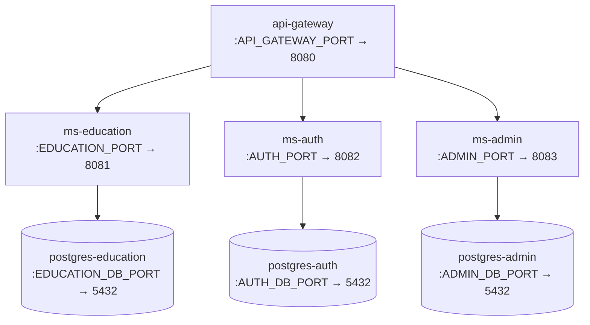

The GEMS LMS platform ships with a `docker-compose.yml` that defines all seven services — the API gateway, three application microservices, and three PostgreSQL databases — along with their network configuration, health checks, and restart policies.

## Prerequisites

- [Docker Engine](https://docs.docker.com/engine/install/) 24.0 or later
- [Docker Compose](https://docs.docker.com/compose/install/) v2.20 or later
- A `.env` file at the project root (see [Configuration](/deployment/configuration))

## Service topology

The stack forms a two-tier dependency chain. Each application service waits for its database to be healthy before starting, and the API gateway waits for all three application services.



All containers communicate over the `gems-lms-network` bridge network. Only the ports declared in `docker-compose.yml` are exposed to the host.

## Starting the stack

<Steps>
  <Step title="Clone the repository and enter the project root">
    ```bash
    git clone https://github.com/GEMS-INNOVATIONS/gems-lms-api.git
    cd gems-lms-api
    ```
  </Step>

  <Step title="Create your .env file">
    Copy the example environment file and set values appropriate for your environment. See [Configuration](/deployment/configuration) for the full variable reference.

    ```bash
    cp .env.example .env
    ```

    At minimum, set the port variables before continuing:

    ```bash
    API_GATEWAY_PORT=8080
    EDUCATION_PORT=8081
    AUTH_PORT=8082
    ADMIN_PORT=8083
    ```
  </Step>

  <Step title="Build the Docker images">
    The build context is the project root. Each service Dockerfile copies only the modules it needs, so builds are independent.

    ```bash
    docker compose build
    ```

    <Tip>Add `--no-cache` to force a clean rebuild: `docker compose build --no-cache`</Tip>
  </Step>

  <Step title="Start all services in the background">
    ```bash
    docker compose up -d
    ```

    Docker Compose starts the PostgreSQL instances first, waits for their health checks to pass, then starts the application services, and finally the API gateway.
  </Step>

  <Step title="Verify everything is running">
    ```bash
    docker compose ps
    ```

    All services should show `healthy` or `running` status. See [Health checks](/deployment/health-checks) for detailed monitoring commands.
  </Step>
</Steps>

## Stopping the stack

<CodeGroup>

```bash Stop services (keep volumes)
docker compose down
```

```bash Stop services and remove volumes
docker compose down -v
```

</CodeGroup>

<Warning>
Running `docker compose down -v` permanently deletes all PostgreSQL data. Use this only when you intend to start with a clean database state.
</Warning>

## Common operations

### View logs

```bash
# Stream logs for all services
docker compose logs -f

# Stream logs for a specific service
docker compose logs -f api-gateway
docker compose logs -f ms-education
docker compose logs -f ms-auth
docker compose logs -f ms-admin
```

### Restart a single service

```bash
docker compose restart ms-education
```

### Rebuild and restart a single service

```bash
docker compose up -d --build ms-auth
```

## Network configuration

All services are attached to a single bridge network defined at the bottom of `docker-compose.yml`:

```yaml
networks:
  gems-network:
    driver: bridge
    name: gems-lms-network
```

Services reference each other by their service name (e.g., `postgres-education`) within the network. The R2DBC URLs use these DNS names directly:

```
r2dbc:postgresql://postgres-education:${EDUCATION_DB_PORT}/${EDUCATION_DB_NAME}
```

## Volumes

Three named volumes provide durable PostgreSQL storage across container restarts:

| Volume | Used by |
|--------|---------|
| `postgres_admin_data` | `postgres-admin` |
| `postgres_auth_data` | `postgres-auth` |
| `postgres_education_data` | `postgres-education` |

Volumes are declared at the top level of `docker-compose.yml` and are not removed unless you run `docker compose down -v`.

## Multi-stage Docker builds

Every service Dockerfile uses a two-stage build to keep runtime images lean:

```dockerfile
# Stage 1 — build
FROM eclipse-temurin:24-jdk as builder
WORKDIR /app
COPY gradlew .
COPY gradle gradle
COPY build.gradle .
COPY settings.gradle .
COPY shared shared
COPY <service-dir> <service-dir>
RUN chmod +x gradlew
RUN ./gradlew :<service>:build -x test

# Stage 2 — runtime
FROM eclipse-temurin:24-jre
WORKDIR /app
COPY --from=builder /app/<service-dir>/build/libs/*.jar app.jar
EXPOSE <port>
ENTRYPOINT ["java", "-jar", "app.jar"]
```

The builder stage uses `eclipse-temurin:24-jdk` to compile and assemble the Gradle project. The runtime stage uses the smaller `eclipse-temurin:24-jre` image and copies only the compiled JAR, keeping the final image free of build tooling.

## Full docker-compose.yml

```yaml
version: '3.8'

services:
  api-gateway:
    build:
      context: .
      dockerfile: api-gateway/Dockerfile
    container_name: gems-api-gateway
    ports:
      - "${API_GATEWAY_PORT}:8080"
    environment:
      - API_GATEWAY_PORT=${API_GATEWAY_PORT}
    networks:
      - gems-network
    depends_on:
      - ms-education
      - ms-auth
      - ms-admin
    restart: unless-stopped
    healthcheck:
      test: ["CMD", "curl", "-f", "http://localhost:8080/actuator/health"]
      interval: 30s
      timeout: 10s
      retries: 3
      start_period: 40s

  ms-education:
    build:
      context: .
      dockerfile: ms-education/Dockerfile
    container_name: gems-ms-education
    ports:
      - "${EDUCATION_PORT}:8081"
    environment:
      - EDUCATION_PORT=${EDUCATION_PORT}
      - EDUCATION_R2DBC_URL=r2dbc:postgresql://postgres-education:${EDUCATION_DB_PORT}/${EDUCATION_DB_NAME}
      - EDUCATION_R2DBC_USERNAME=${EDUCATION_DB_USER}
      - EDUCATION_R2DBC_PASSWORD=${EDUCATION_DB_PASSWORD}
    networks:
      - gems-network
    depends_on:
      postgres-education:
        condition: service_healthy
    restart: unless-stopped
    healthcheck:
      test: ["CMD", "curl", "-f", "http://localhost:8081/actuator/health"]
      interval: 30s
      timeout: 10s
      retries: 3
      start_period: 40s

  ms-auth:
    build:
      context: .
      dockerfile: ms-auth/Dockerfile
    container_name: gems-ms-auth
    ports:
      - "${AUTH_PORT}:8082"
    environment:
      - AUTH_PORT=${AUTH_PORT}
      - AUTH_R2DBC_URL=r2dbc:postgresql://postgres-auth:${AUTH_DB_PORT}/${AUTH_DB_NAME}
      - AUTH_R2DBC_USERNAME=${AUTH_DB_USER}
      - AUTH_R2DBC_PASSWORD=${AUTH_DB_PASSWORD}
    networks:
      - gems-network
    depends_on:
      postgres-auth:
        condition: service_healthy
    restart: unless-stopped
    healthcheck:
      test: ["CMD", "curl", "-f", "http://localhost:8082/actuator/health"]
      interval: 30s
      timeout: 10s
      retries: 3
      start_period: 40s

  ms-admin:
    build:
      context: .
      dockerfile: ms-admin/Dockerfile
    container_name: gems-ms-admin
    ports:
      - "${ADMIN_PORT}:8083"
    environment:
      - ADMIN_PORT=${ADMIN_PORT}
      - ADMIN_R2DBC_URL=r2dbc:postgresql://postgres-admin:${ADMIN_DB_PORT}/${ADMIN_DB_NAME}
      - ADMIN_R2DBC_USERNAME=${ADMIN_DB_USER}
      - ADMIN_R2DBC_PASSWORD=${ADMIN_DB_PASSWORD}
    networks:
      - gems-network
    depends_on:
      postgres-admin:
        condition: service_healthy
    restart: unless-stopped
    healthcheck:
      test: ["CMD", "curl", "-f", "http://localhost:8083/actuator/health"]
      interval: 30s
      timeout: 10s
      retries: 3
      start_period: 40s

  postgres-admin:
    image: postgres:16
    container_name: gems-postgres-admin
    environment:
      - POSTGRES_DB=${ADMIN_DB_NAME:-admin_db}
      - POSTGRES_USER=${ADMIN_DB_USER:-admin_user}
      - POSTGRES_PASSWORD=${ADMIN_DB_PASSWORD:-admin_password}
    ports:
      - "${ADMIN_DB_PORT:-5432}:5432"
    volumes:
      - postgres_admin_data:/var/lib/postgresql/data
    networks:
      - gems-network
    restart: unless-stopped
    healthcheck:
      test: ["CMD-SHELL", "pg_isready -U ${ADMIN_DB_USER:-admin_user} -d ${ADMIN_DB_NAME:-admin_db}"]
      interval: 10s
      timeout: 5s
      retries: 5

  postgres-auth:
    image: postgres:16
    container_name: gems-postgres-auth
    environment:
      - POSTGRES_DB=${AUTH_DB_NAME:-auth_db}
      - POSTGRES_USER=${AUTH_DB_USER:-auth_user}
      - POSTGRES_PASSWORD=${AUTH_DB_PASSWORD:-auth_password}
    ports:
      - "${AUTH_DB_PORT:-5433}:5432"
    volumes:
      - postgres_auth_data:/var/lib/postgresql/data
    networks:
      - gems-network
    restart: unless-stopped
    healthcheck:
      test: ["CMD-SHELL", "pg_isready -U ${AUTH_DB_USER:-auth_user} -d ${AUTH_DB_NAME:-auth_db}"]
      interval: 10s
      timeout: 5s
      retries: 5

  postgres-education:
    image: postgres:16
    container_name: gems-postgres-education
    environment:
      - POSTGRES_DB=${EDUCATION_DB_NAME:-education_db}
      - POSTGRES_USER=${EDUCATION_DB_USER:-education_user}
      - POSTGRES_PASSWORD=${EDUCATION_DB_PASSWORD:-education_password}
    ports:
      - "${EDUCATION_DB_PORT:-5434}:5432"
    volumes:
      - postgres_education_data:/var/lib/postgresql/data
    networks:
      - gems-network
    restart: unless-stopped
    healthcheck:
      test: ["CMD-SHELL", "pg_isready -U ${EDUCATION_DB_USER:-education_user} -d ${EDUCATION_DB_NAME:-education_db}"]
      interval: 10s
      timeout: 5s
      retries: 5

volumes:
  postgres_admin_data:
  postgres_auth_data:
  postgres_education_data:

networks:
  gems-network:
    driver: bridge
    name: gems-lms-network
```
